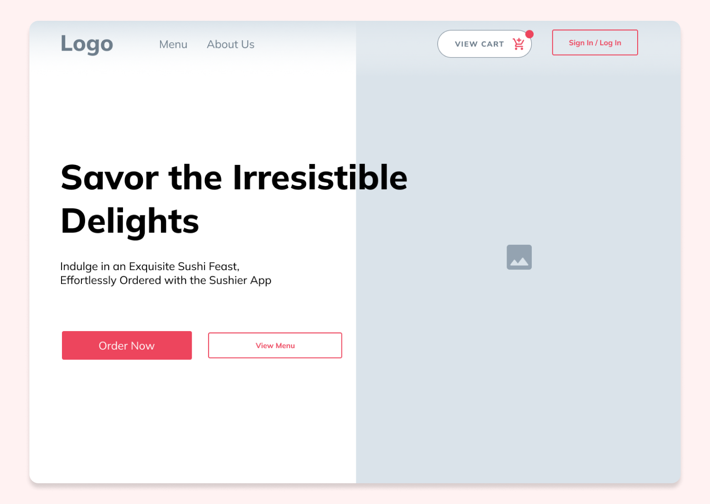

# Sushier Design Materials Repository

Welcome to the Design Materials Repository for Sushier! This repository contains design-related assets, including Figma files, design guidelines, and more.

## Table of Contents

- [Figma Design Files](#figma-design-files-art)
- [Mockups and Prototypes](#mockups-and-prototypes-rocket)
- [Contributing](#contributing-handshake)

## Figma Design Files :art:

Explore our design concepts, wireframes, and prototypes using Figma. You can view, comment, and gain insights into our design process. Click on the links below to access each Figma file:

1. [Project Brief](https://www.figma.com/file/jT4PadUfzNqQbXYFthRkoC/Sushier-MoodBoard?type=design&node-id=8%3A36&mode=design&t=PvMtJne5UkPt2jKF-1)
   - **Description**: The Project Brief is the initial step in our design process, defining what we are building, the desired functionality, and project objectives. It serves as a roadmap for our design journey, outlining the project's scope and goals.

2. [Mood Board](https://www.figma.com/file/jT4PadUfzNqQbXYFthRkoC/Sushier-MoodBoard?type=design&node-id=0%3A1&mode=design&t=PvMtJne5UkPt2jKF-1)
   - **Description**: The Mood Board sets the tone for our design by showcasing visual inspirations and themes that influenced our choices. It helps us establish a consistent look and feel for Sushier.

3. [Wireframe](https://www.figma.com/file/jT4PadUfzNqQbXYFthRkoC/Sushier-MoodBoard?type=design&node-id=9%3A57&mode=design&t=PvMtJne5UkPt2jKF-1)
   - **Description**: The Wireframe represents the skeletal structure of our application, defining layout and functionality. It guides the layout and interaction design process.

   

## Mockups and Prototypes :rocket:

Take a closer look at our design journey with mockups and interactive prototypes. These materials showcase how our design ideas evolved into the final product.

- [Mockup 1](https://www.figma.com/file/jT4PadUfzNqQbXYFthRkoC/Sushier-MoodBoard?type=design&node-id=46%3A1884&mode=design&t=PvMtJne5UkPt2jKF-1)

## Contributing :handshake:

We welcome contributions and feedback on our design materials. If you have suggestions, ideas, or improvements, please feel free to reach out to [Ziqi's Email](mailto:zfang1207@gmail.com) or connect on [LinkedIn](https://linkedin.com/in/ziqi-fang).

